# Data and Tool Integrations

This article explains about how to setup below Integration in Watson AIOps.

- Humio Integration
- ServiceNow Integration
- Kubernetes Integration

The article is based on the the following.

- RedHat OpenShift 4.6 on IBM Cloud (ROKS)
- Watson AI-Ops 3.1.0

## 1. Setup Humio Integration

This section explains about how to setup Humio Integration in Watson AIOps.

1. Goto the page `Data and tool integrations`

2. In the `Humio` card click on the `Add Integration` link

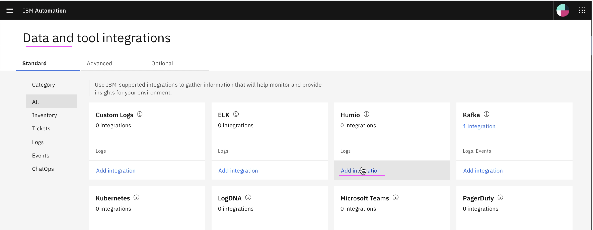


3. Enter the below field values

```
- Name 
- Humio sevice URL

    Sample value : http://1.1.1.1:8080/api/v1/repositories/sandbox/query

- API Key of the Humio
- Keep `Data flow` off
```

4. Click on `Integrate` 

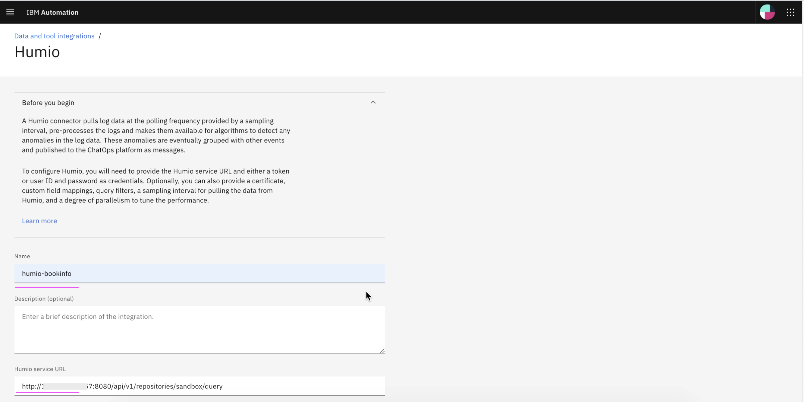
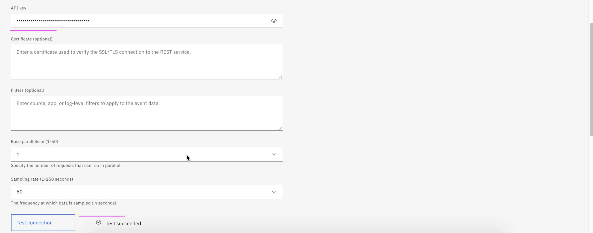
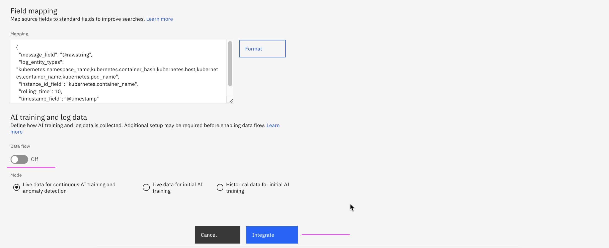

5. Integration is created.

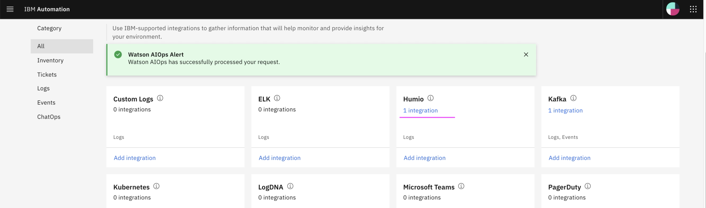


## 2. Setup ServiceNow Integration

This section explains about how to setup ServiceNow Integration in Watson AIOps.

1. Goto the page `Data and tool integrations`

2. In the `ServiceNow` card click on the `Add Integration` link

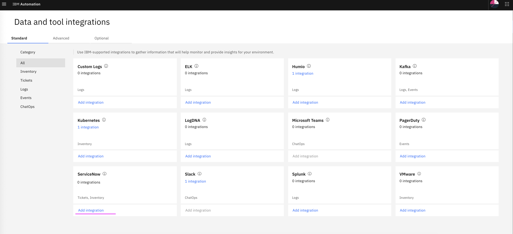

3. Enter the below field values

```
- Name 
- URL
    Sample value : https://dev-11111.service-now.com

- UserID
- Password

- Data flow - on
- Historical Data for initial AI Training
- Start date (2 years old)
- End date (current date)
```

4. Click on `Integrate`

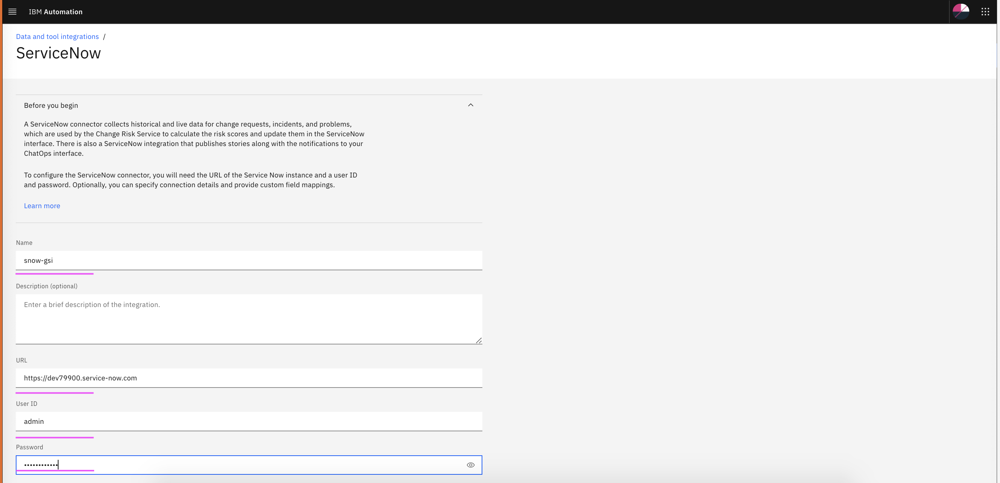

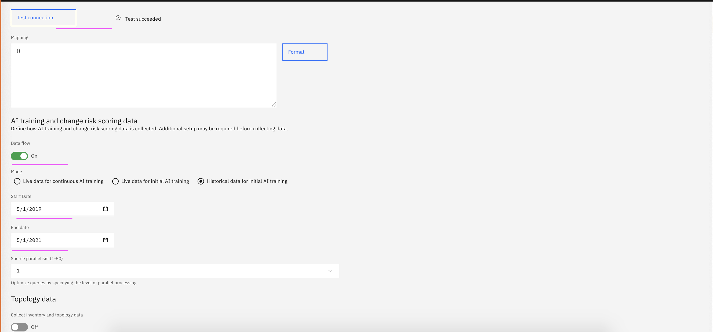
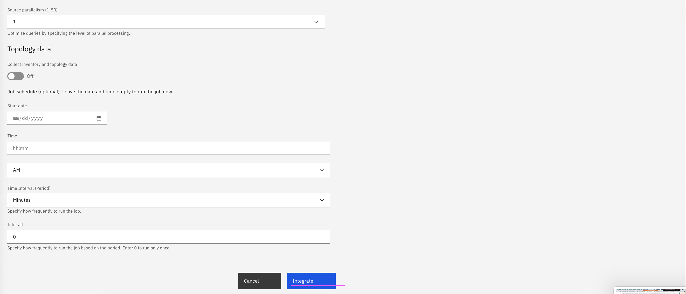

5. Integration is created.

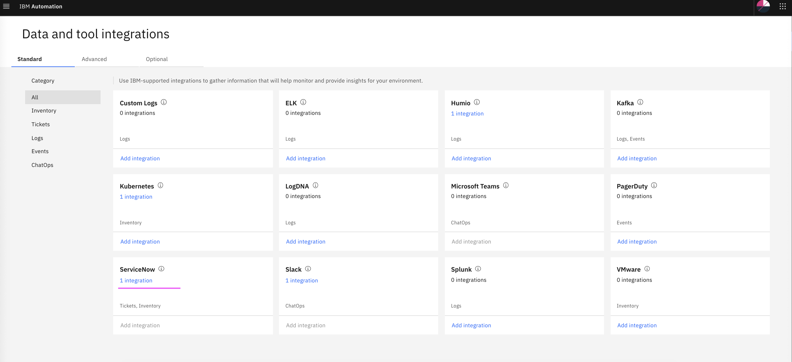


## 3. Setup Kubernetes Integration

This section explains about how to setup Kubernetes Integration in Watson AIOps.

1. Goto the page `Data and tool integrations`

2. In the `Kubernetes` card click on the `Add Integration` link

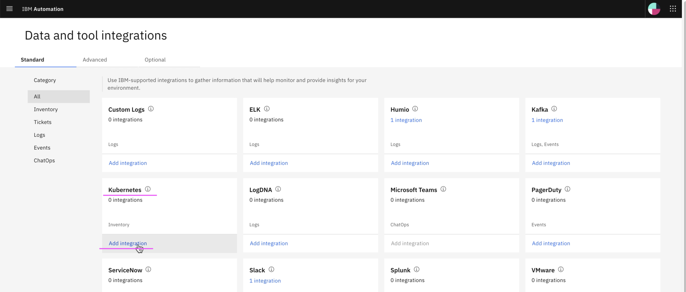

3. Enter values for highlighed field and click on `Integrate`

The below table describes some important fields.

<table>
    <tr>
        <td>Field</td>
        <td>Description</td>
        <td>Sample Value</td>
    </tr>
    <tr>
        <td>Name</td>
        <td>Name of the application</td>
        <td>bookinfo</td>
    </tr>
    <tr>
        <td>Data Center</td>
        <td>Data Center in which the applicaiton is available</td>
        <td>bookinfo-dc</td>
    </tr> 
    <tr>
        <td>Connection type</td>
        <td>Local or Remote cluster</td>
        <td>Load  (for remote cluster)</td>
    </tr>
    <tr>
        <td>Kubernetes master IP address</td>
        <td>IP address / domain of IKS/OCP cluster where your app is installed</td>
        <td>c111.us-south.containers.cloud.ibm.com</td>
    </tr>
    <tr>
        <td>Kubernetes API port</td>
        <td>Port of IKS/OCP cluster where your app is installed</td>
        <td>12345</td>
    </tr>    
    <tr>
        <td>Encrypted Kubernetes token</td>
        <td>

Refer [here](https://github.com/ibm-gsi-ecosystem/watson-ai-ops-guide/tree/master/600-getting-cluster-access-token)
       
Refer KC [here](https://www.ibm.com/docs/en/cloud-paks/cp-waiops/3.1.0?topic=integrations-kubernetes)
        </td>
        <td></td>
    </tr>
    <tr>
        <td>Namespaces to observe</td>
        <td>Namespaces where your app installed</td>
        <td>devbi</td>
    </tr>  
    <tr>
        <td>Interval</td>
        <td>Interval minutes in which the observer jobs to be executed</td>
        <td>5</td>
    </tr>
</table>

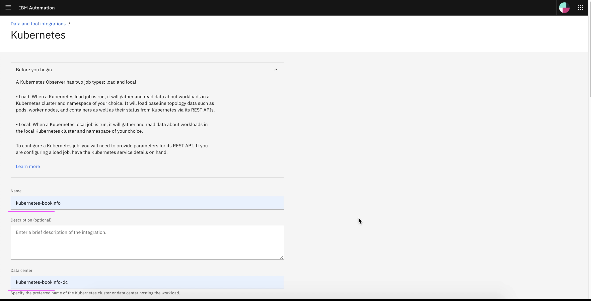
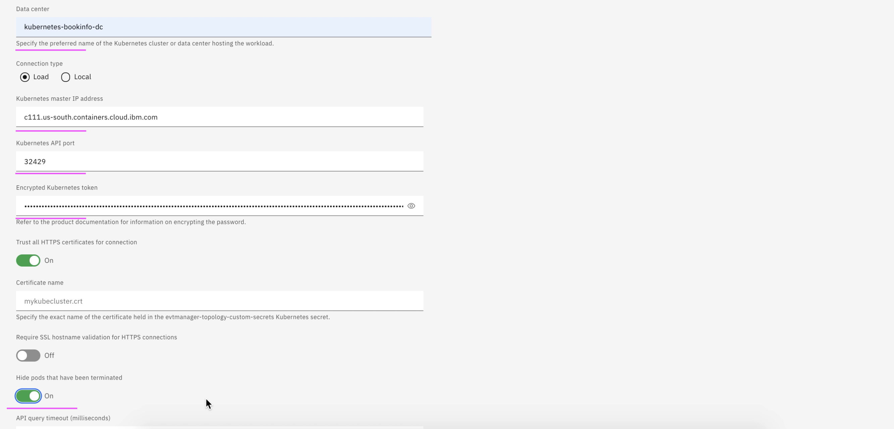
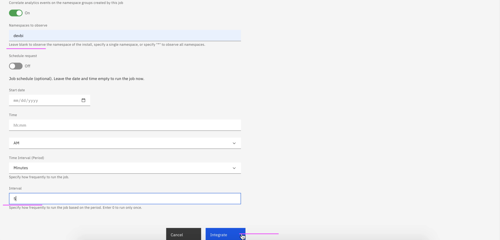
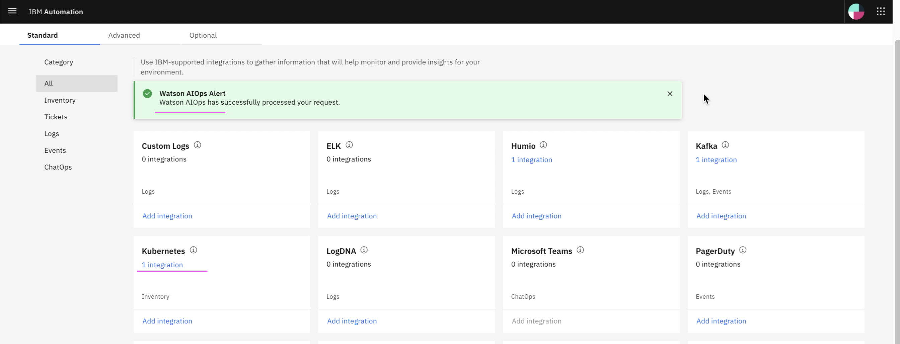


5. Goto on `Application Management` 

The given namespace `devbi` is observed and a group with the same name `devbi` is created. 

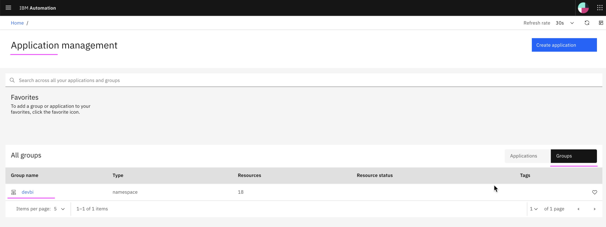


### Authors
- Jeya Gandhi Rajan M
- Vijaya Bhaskar R Siddareddi
- Vijay Sukthankar (Squad Leader)

**Hybrid-Cloud Squad**

**GSI Labs**
