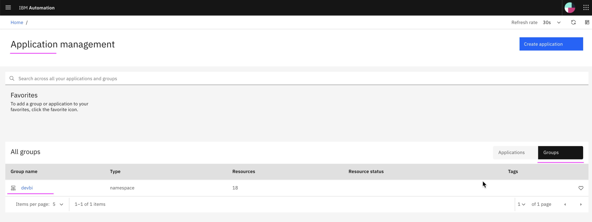
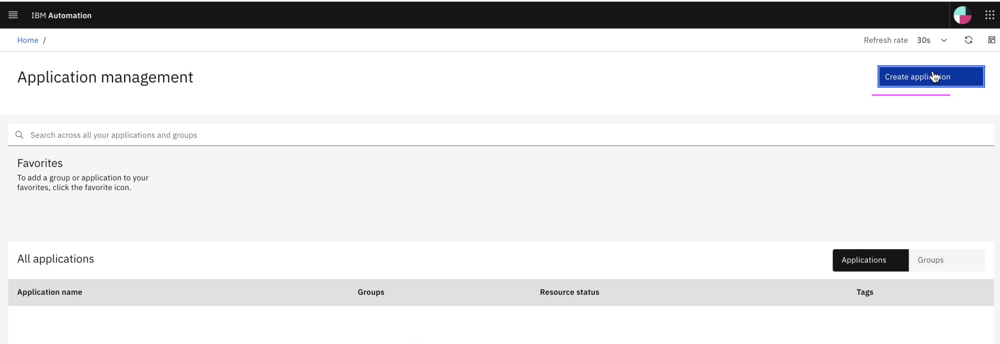
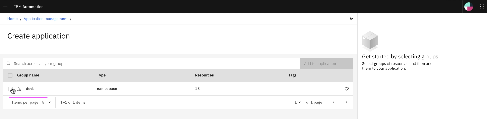
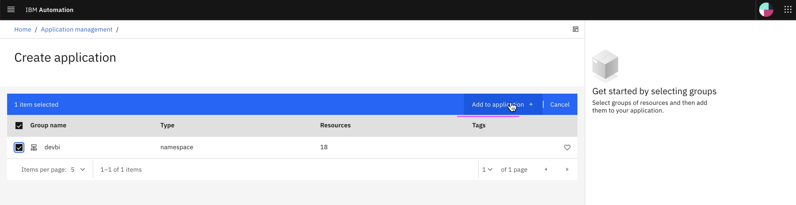
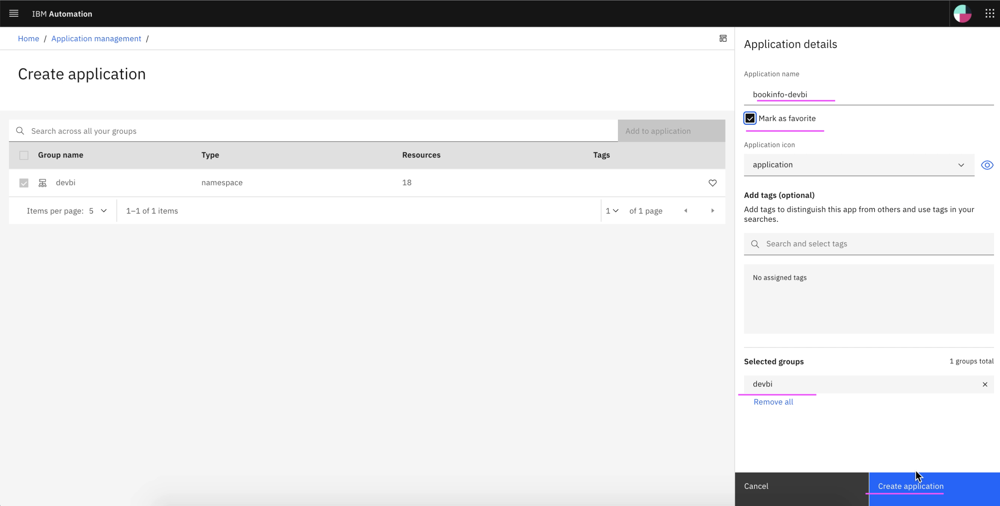
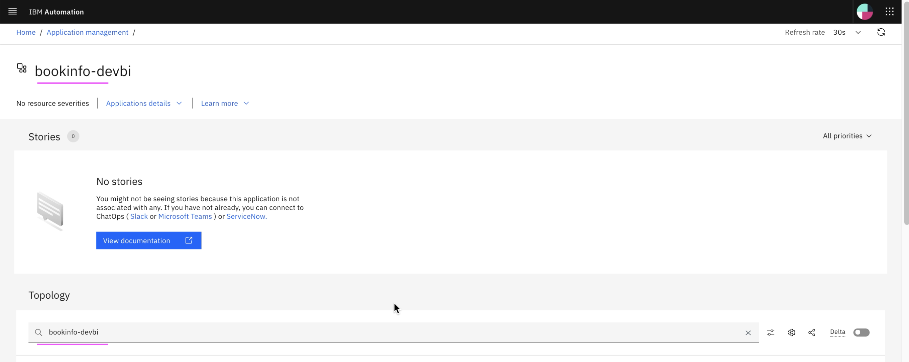
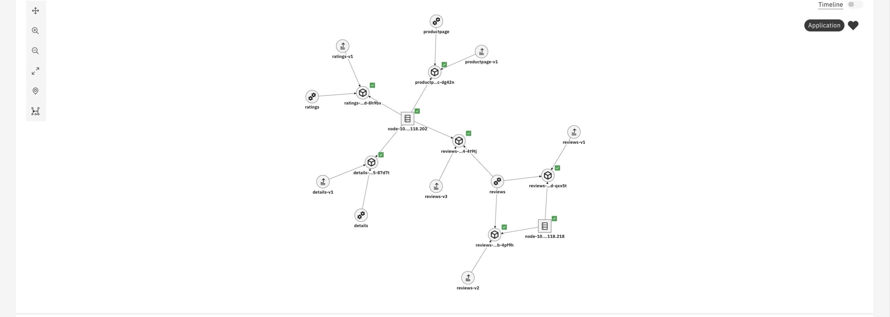
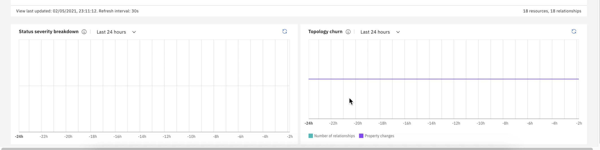

# Create Application using Kubernetes Observer

This article explains about how to Create Application using Kubernetes Observer in Watson AIOps.

The article is based on the the following

- RedHat OpenShift 4.6 on IBM Cloud (ROKS)
- Watson AI-Ops 3.1.0

1. Goto `Application Management` screen

Application management screen shows list of `groups` which are observered through Kubernetes observer.

The list shows a group called `devbi`.

Kubernetes resources, such as pod, service, deployment, node and etc, available in the namespace `devbi` should have been observed through Kubernetes observer and the group `devbi` should have been created. 

To know how to create kubernetes observer, you can refer the link http://abcd.com

2. Click on `Create Application` to create a new application from the group.

3. Choose the group `devbi` to create application from this group.

4. Click on `Add to Application` button

5. Enter any value in `Application Name`.

Check the `Mark as Favorite` checkbox to mark this application to display in your favorite list.

Make sure `devbi` group is listed in the selected group.

Click on `Create Application` button to create the application.

6. Application is created and displayed like the below.

This application page also shows the topology digram of the application, which contains the pod, service, deployment, node and etc. It contains microservices such as Product Page, Reviews, Ratings and Details.

