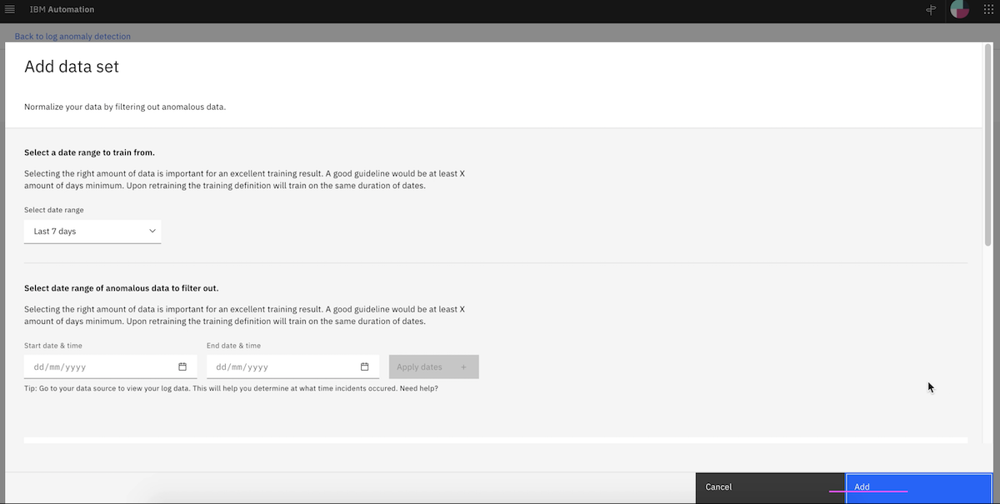
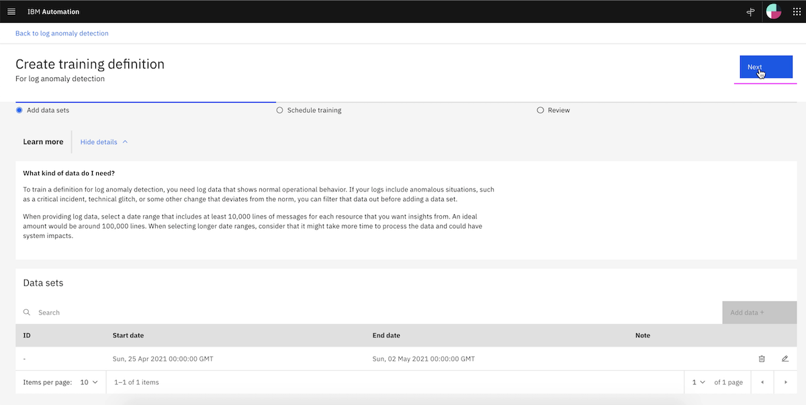

# Create Training Definition for Logs, Events and Incidents

This article explains about how to Create Training Definition for  in Watson AIOps.

- Log Anomaly detection
- Event Grouping
- Similar Incidents

The article is based on the the following

- RedHat OpenShift 4.6 on IBM Cloud (ROKS)
- Watson AI-Ops 3.1.0

## 1. Create Training Definition for Log Anomaly

This section explains about how to Create Training Definition for Log Anomaly
 in Watson AIOps.

1. Goto the page `Data and Model Management`

2. Click on `Log anomaly detection` card

3. Click on `Create training definition` to create a new training definition.

4. Click on `Add data` button

5. Click on `Add` button to add the data set.

Here last 7 days is choosen by default. Make sure you click the list box and choose the current day + 1 for the training.

The training definition is created.

6. Click on `Next` button.

7. Enter value in `Name your training definition` text box. You can enter any value here for your reference.

8. Click on `Next`

9. Review the values and Click on `Create` button.

10. The training definition is created for the log anomaly detection.

## 2. Create Training Definition for Event Grouping

This article explains about how to Create Training Definition for Event Grouping in Watson AIOps.

1. Goto the page `Data and Model Management`

2. Click on `Event Grouping Service` card

3. Click on `Create training definition`  to create a new training definition.

4. Click on `Add data`

5. Click on `Add` button to add the data set.

Here last 7 days is choosen by default. Make sure you click the list box and choose the current day + 1 for the training.

6. Click on `Next`

7. Enter value in `Name your training definition` text box. You can enter any value here for your reference.

8. Click on `Next`

9. Review the values and Click on `Create` button.

10. The training definition is created for the event grouping.

## 3. Create Training Definition for Similar Incidents

This section explains about how to Create Training Definition for Similar Incidents in Watson AIOps.

1. Goto the page `Data and Model Management`

2. Click on `Similar Incidents` card

3. Click on `Create training definition`  to create a new training definition.

4. Enter value in `Name your training definition` text box. You can enter any value here for your reference.

5. Click on `Next`

6. Review the values and Click on `Create` button.

7. The training definition is created for the similar incidents.

