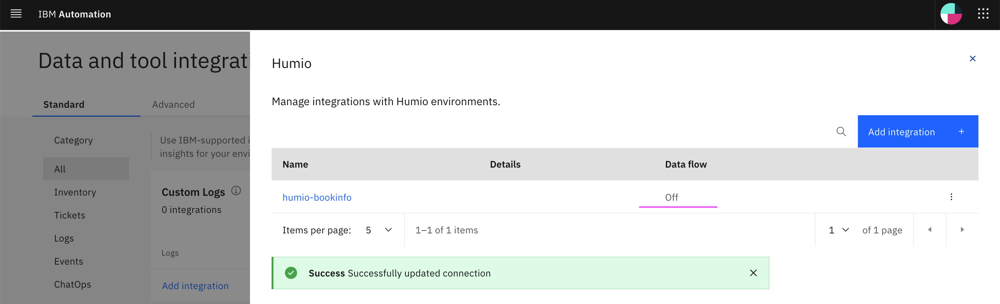

# Training Logs, Events and Incidents

This article explains about how to do Training for the following in Watson AIOps.

- Log Anomaly detection
- Event Grouping
- Similar Incidents

## 1. Training - Log Amomaly Detection

This section explains about how to do Training of Log Amomaly Detection in Watson AIOps.

### Application

Here is the application page looks like.

And assume that app is accessible via link http://1.1.1.1:31600/productpage?u=normal


### Generate Load

The below script can be used for generating load.

Run this script and Generate load.

```bash
#!/bin/bash

while (true)
do
    ab -n 100 -c 5 http://1.1.1.1:31600/productpage?u=normal
done

```

### Load Live logs for Training

Enable the live logs for the training.


Keep in this state for 10 minutes.

### Stop Live logs

After 10 minutes, live logs can be disbled.




### Stop Load

Click on Ctrl+C to stop load script.

### Start Training


Training is started.


If you have this `Needs improvement` status then you need to load some more logs.

Need around 10K lines logs for each component/micro service of the app.


Now the trianing status is `Good` and `Deployed`.


The trained version is `v8`.


## 2. Training - Event Grouping

This section explains about how to do Training of Event Grouping in Watson AIOps.

### Preparation

#### Sample Events Files for Training

The sample events data file is available here [02-noi-alerts.json](./files/02-noi-alerts.json).

#### Pushing events for Training

The script to push events into kafka topic `alerts-noi-1000-1000` for training is available here [01-post-training-events.sh](./files/01-post-training-events.sh).

```bash
oc extract secret/strimzi-cluster-cluster-ca-cert --keys=ca.crt --to=- > ca.crt
export SASL_PASSWORD=$(oc get secret token --template={{.data.password}} | base64 --decode)
export SEC="-X security.protocol=SSL -X ssl.ca.location=ca.crt -X sasl.mechanisms=SCRAM-SHA-512 -X sasl.username=token -X sasl.password=$SASL_PASSWORD"
export BROKER=$(oc get routes strimzi-cluster-kafka-bootstrap -o=jsonpath='{.status.ingress[0].host}{"\n"}'):443

kafkacat $SEC -b $BROKER -P -t alerts-noi-1000-1000 -l ./02-noi-alerts.json
```

To know more about how to access kafka topics refer here [800-accessing-kafka-topics](../800-accessing-kafka-topics)

### Enable Data flow for Training


### Push training events to kafka topic

Run the below command to push training events to kafka topic.

```bash
sh ./files/01-post-training-events.sh
```
### Disable Data flow


### Start Training


## 3. Training - Similar Incidents

This section explains about how to do Training of Similar Incidents in Watson AIOps.

The article is based on the the following

- RedHat OpenShift 4.6 on IBM Cloud (ROKS)
- Watson AI-Ops 3.1.0

### Preparation

#### Sample Incidents  for Training

Atleast 5 incidents should have been created in service-now, resolved with proper resolve comments and closed.

Here are the sample incidents from service now.


### Enable Data flow for Training

Make sure the following

- Data flow is on
- Historical data for Initial AI-Training
- Start Date should be past date 
- End Date could be current date 


### Start Training

Start the training


