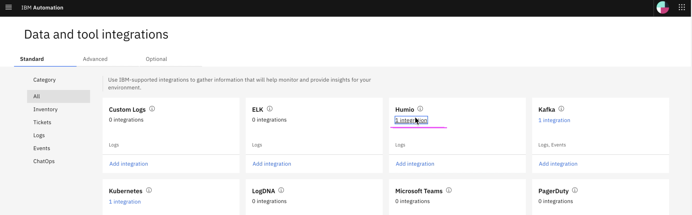

# Inferencing Inferencing Log Anomaly, Event Grouping and Similar Incidents

This article explains about how to do Inferencing of Log Amomaly Detection, Event grouping service and Similar incident service in Watson AIOps.

The article is based on the the following

- RedHat OpenShift 4.6 on IBM Cloud (ROKS)
- Watson AI-Ops 3.1.0

## Enable Data flow in Humio Integration

Choose the `Humio` integration from the `Data and Tool integrations` page.

Click on the listed humio integation item.

Enable the `Data flow` on.

Select the `Live data for Continious AI Training and anomaly detection` option.

Click on `Save` button.

## Enable Data flow in Kafka Integration (for events)

Choose the `Kafka` integration from the `Data and Tool integrations` page.

Click on the listed kafka integation item.

Enable the `Data flow` on.

Select the `Data feed for Continious AI Training and anomaly detection` option.

Click on `Save` button.

## Induce Error

The demo script is avialable [here](../800-demo-script). 

Run `sh 01-demo.sh` to start the demo.

You will see the menu options like this.

Enter `1` to choose the menu option `1  -  Introduce anomaly into BookInfo App`

The output of the option 1 would be like the below.

This demo option will scale down the ratings pod to 0, push  2 error events to event manager. It will also access the bookinfo application through script. As a result, the log anomaly is created, grouped with events alerts and story will be created in the slack.  

## Stories in Application

By sucessful execution of the above demo step, the story would have been created and it would be displayed in the Application page. 

The topology is also updated with error events. 

#### Stories in detail

You can click and view the story details from the Application details page.

## Stories in Slack

The same stories are displayed in the slack as well, as we have integrated the slack as a chatops in the AIOps integration page.

