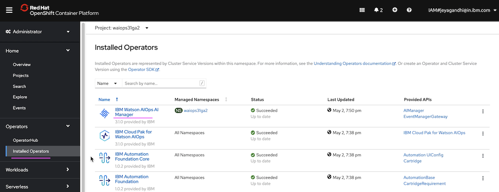
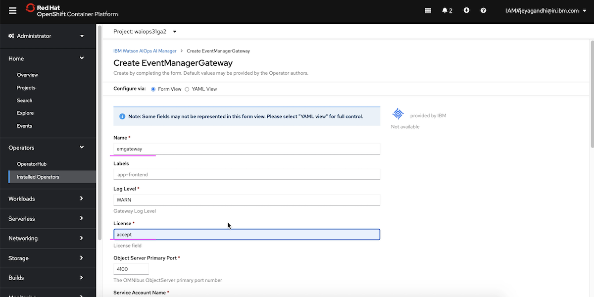
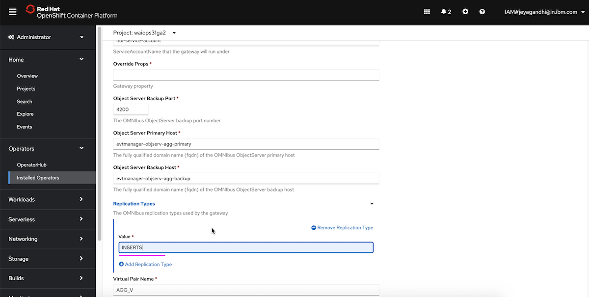
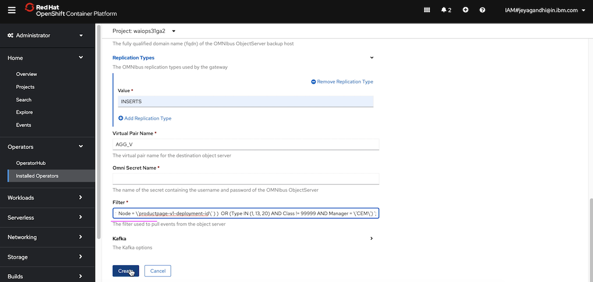

# Configure Event Manager Gateway

The article explains about the following configuration on Event Manager in Watson AIOps. 

- Configure Event Manager Gateway
- Exposing an ObjectServer in Event Manager

The article is based on the the following

- RedHat OpenShift 4.6 on IBM Cloud (ROKS)
- Watson AI-Ops 3.1.0

## 1. Configure Event Manager Gateway

The section explains about how to Configure Event Manager Gateway in Watson AIOps. This event manager gateway helps to push events from Event Manager to AI-Manager.

Here are the steps to create Event Manager Gateway.

1. Goto `Installed Operators` Page in the Openshift Container Platform. 



2. Click on `IBM Watson AIOps AI Manager` operator

3. Click on `Create Instance` in `Event Manager Gateway` card


4. Enter any value in `Name` field



5. Enter `accept` in`License` field

6. Enter `INSERTS` in`Replication Type` field



7. Enter the below value in `Filter` field. This is to filter the events, Only the events satisfying the filtered conditions would be send to AI-Manager.

```
( Type IN (1, 13, 20) AND Class != 99999 AND Manager = \'CEM\')
```

If you have metrics manager installed, you can have the filter like this.


```
( (Manager = \'TASP probe running on pi-demo.hybrid-squad.cloud\') AND ( Node = \'details-v1-deployment-id\' OR  Node = \'productpage-v1-deployment-id\' ) )  OR (Type IN (1, 13, 20) AND Class != 99999 AND Manager = \'CEM\')
```



8. Click on `Create` button

The event mangaer gateway should have been created.

## 2. Exposing an ObjectServer in Event Manager

This section explain about how to expose the ObjectServer of the Event Manager outside cluster, which helps to push events to event manager through CURL.

### Overview

#### 1. Login to the OCP

Login into the OCP cluster where you have AIOps Installed.

#### 2. Edit configmap 

2.1 Edit the configmap suffixed with `objserv-agg-primary-config`

Run the below command

```bash
oc get configmap | grep agg-primary-config
```

Mostly you will get the `evtmanager-objserv-agg-primary-config` as an output. If so use the below command as it is. Otherwise change the confimap and use it.

```
oc edit configmap evtmanager-objserv-agg-primary-config
```

2.1 Update the below property.

```bash
data:
  agg-p-props-append: |
    NRestOS.Enable: TRUE
    NHttpd.EnableHTTP: TRUE
    NHttpd.ListeningPort: 8080
```

#### 3. Recreate pod 

Delete the pod suffixed with `ncoprimary-0`, to reflect the configmap changes.

```bash
oc get pod | grep ncoprimary-0
```

Mostly you will get the `evtmanager-ncoprimary-0` as an output. Run the below command, if required change the pod name.

```
oc delete pod evtmanager-ncoprimary-0
```

Wait here until the pod is recreated.

#### 4. Create Service

Expose the above pod (after it is recreated) and create a service called `objserver-nodeport`

Use right pod name here.

```bash
oc expose pod evtmanager-ncoprimary-0 --port=8080 --type=NodePort --name=objserver-nodeport
```

#### 5. Create Route

Expose the above service and create route called `objectserver-route`

```bash
oc expose service objserver-nodeport --name=objectserver-route --port=8080
```

#### 6. Retrieve host path

Get the host path from the above created route.

```bash
oc get route objectserver-route -o yaml
```

It may be like this `aiops-abcd.appdomain.cloud`

By framing the url like the below, we can push the events to eventmanger

`http://objectserver-route-aiops-abcd.appdomain.cloud/objectserver/restapi/alerts/status`


#### 7. Retrieve Password

To push events, we need password along with the above url.

Get the password from the secret ends with `omni-secret`

```bash
oc get secret noi-omni-secret -o yaml
```

You need to decrypt the password like this.

```bash
echo "asdfasdfsadfasdfsd" | base64 -d
```

The output could be `pMl4XUx3TsIFAbC`


### Pushing Events to EventManagr using Curl

You can push events like the below.

```bash
curl -X POST -v -u root:pMl4XUx3TsIFAbC -H "Accept: application/json" -H "Content-Type: application/json" -d @ratings_pod_down.json http://objectserver-route-aiops-abcd.appdomain.cloud/objectserver/restapi/alerts/status
```

The `ratings_pod_down.json` down file is avilable [here](./files/ratings_pod_down.json) , which you can copy to the current folder where you run the above script.


### Reference

Exposing an ObjectServer port in a Netcool® Operations Insight on Red Hat® OpenShift® deployment
https://www.ibm.com/support/knowledgecenter/SSTPTP_1.6.3/com.ibm.netcool_ops.doc/soc/integration/task/expose_objs_port.html

Install the Event Manager Gateway with the OpenShift console

https://www.ibm.com/docs/en/cloud-paks/cp-waiops/3.1.0?topic=installing-post-installation-tasks#install-emg-console

