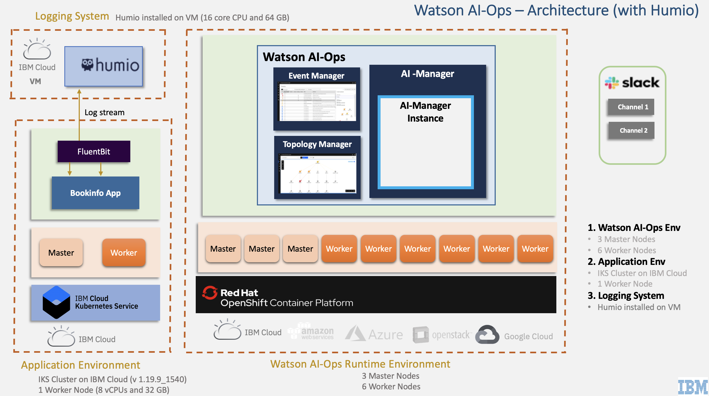

# BookInfo Demo Setup

This document explains BookInfo demo setup for Watson AIOps 3.1.0.

The article is based on the the following
 - RedHat OpenShift 4.6 on IBM Cloud (ROKS)
 - Watson AIOps 3.1.0

Here are the steps involved.

### 1. Watson AIOps 3.1 Installation

<table>
    <tr>
        <td width="4%">S.No</td>
        <td width="84%">Title</td>
        <td width="12%">Reference</td>
    </tr>
    <tr>
        <td>1.1</td>
        <td>IBM Doc AI-Ops 3.1</td>
        <td>

[Details ...](https://www.ibm.com/docs/en/cloud-paks/cp-waiops/3.1.0) 
        </td>
    </tr>
    <tr>
        <td>1.2</td>
        <td>Preparing to install IBM Cloud Pak for Watson AIOps </td>
        <td>

[Details ...](https://www.ibm.com/docs/en/cloud-paks/cp-waiops/3.1.0?topic=installing-preparing-install-cloud-pak) 
        </td>
    </tr>
    <tr>
        <td>1.3</td>
        <td>Preparing to install IBM Cloud Pak for Watson AIOps</td>
        <td>

[Details ...](https://www.ibm.com/docs/en/cloud-paks/cp-waiops/3.1.0?topic=installing-cloud-pak) 
        </td>
    </tr>
    <tr>
        <td>1.4</td>
        <td>Install Predictive Insights</td>
        <td>

[Details ...](https://www.ibm.com/docs/en/oapi/1.3.6?topic=installing) 
        </td>
    </tr>

</table>

### 2. Pre-requisites on User Laptop  / client linux VM

<table>
    <tr>
        <td width="4%">S.No</td>
        <td width="28%">Title</td>
        <td width="40%">Description</td>
        <td width="20%">Reference</td>
    </tr>
    <tr>
        <td>2.1</td>
        <td>Install Apache Benche </td>
        <td>To create load on bookinfo app</td>
        <td>

[Details ...](https://httpd.apache.org/download.cgi)
        </td>
    </tr>
    <tr>
        <td>2.2</td>
        <td>Other installs </td>
        <td> Openshift CLI, Kubectl CLi, Curl, jq </td>
        <td>
        </td>
    </tr>        
</table>

### 3. Setup Managed Environment

<table>
    <tr>
        <td width="4%">S.No</td>
        <td width="28%">Title</td>
        <td width="40%">Description</td>
        <td width="20%">Reference</td>
    </tr>
    <tr>
        <td>3.1</td>
        <td>Install Bookinfo app</td>
        <td>Install Bookinfo app on the managed environment</td>
        <td>

[Details](https://community.ibm.com/community/user/aiops/blogs/jeya-gandhi-rajan-m1/2021/05/12/aiops-v31-series-08-installing-bookinfo-app-for-ai)</td>
    </tr>
</table>

### 4. Setup Operational Systems

<table>
    <tr>
        <td width="4%">S.No</td>
        <td width="28%">Title</td>
        <td width="40%">Description</td>
        <td width="8%">Environment</td>
        <td width="20%">Reference</td>
    </tr>
        <td>4.1</td>
        <td>Install Humio</td>
        <td>Setup Humio on a single node (16 core, 64 GB)</td>
        <td>Any VM</td>
        <td>

[Details ...](https://github.com/diimallya/humio-single-node)</td>
    </tr>   
    <tr>
        <td>4.2 </td>
        <td>Install fluentbit</td>
        <td>Push the bookinfo logs to Humio (using Fluent-bit data shipper)</td>
        <td>Managed env</td>
        <td>[Details](https://community.ibm.com/community/user/aiops/blogs/jeya-gandhi-rajan-m1/2021/05/12/aiops-v31-series-08-installing-bookinfo-app-for-ai)</td>
    </tr>   
    <tr>
        <td>4.3 </td>
        <td>Create Slack acccount</td>
        <td>Setup free slack account and create workspace, channels and slack app</td>
        <td>Slack</td>
        <td>[Details](https://community.ibm.com/community/user/aiops/blogs/jeya-gandhi-rajan-m1/2021/05/12/aiops-v31-series-02-slack-account-creation-and-int)</td>
    </tr>   
    <tr>
        <td>4.4 </td>
        <td>Create ServiceNow Instance</td>
        <td></td>
        <td>ServiceNow</td>
        <td>[Details ...](https://developer.servicenow.com/dev.do)</td>
    </tr>
       <tr>
        <td>4.5 </td>
        <td>Create Sample Incidents in Service now</td>
        <td></td>
        <td>ServiceNow</td>
        <td>[Details](https://community.ibm.com/community/user/aiops/blogs/jeya-gandhi-rajan-m1/2021/05/12/aiops-v31-series-05-training-logs-events-and-incid)</td>
    </tr>   
  </table>

### 5. Setup Initial Configurations in Watson AIOps 3.1

<table>
    <tr>
        <td width="4%">S.No</td>
        <td width="28%">Title</td>
        <td width="40%">Description</td>
        <td width="20%">Reference</td>
    </tr>
    <tr>
        <td>5.1</td>
        <td>Configure Event Manager Gateway</td>
        <td></td>
        <td>

[Details](https://community.ibm.com/community/user/aiops/blogs/jeya-gandhi-rajan-m1/2021/05/12/aiops-v31-series-07-configuring-event-manager)
        </td>
    </tr>
    <tr>
        <td>5.2</td>
        <td>Enable event ingestion in Event Manager</td>
        <td>Need to expose Event Manager to push events.</td>
        <td>[Details](https://community.ibm.com/community/user/aiops/blogs/jeya-gandhi-rajan-m1/2021/05/12/aiops-v31-series-07-configuring-event-manager)</td>
    </tr>
    <tr>
        <td>5.3</td>
        <td>Setup Slack Integration</td>
        <td>Integrate with Slack collaboration platform. Need to copy nginx certificate as well.</td>
        <td>
[Details](https://community.ibm.com/community/user/aiops/blogs/jeya-gandhi-rajan-m1/2021/05/12/aiops-v31-series-02-slack-account-creation-and-int)
        </td>
    </tr>
    <tr>
        <td>5.4</td>
        <td>Setup Humio Integration</td>
        <td></td>
        <td>
[Details](https://community.ibm.com/community/user/aiops/blogs/jeya-gandhi-rajan-m1/2021/05/12/aiops-v31-series-01-data-and-tool-integrations)
        </td>
    </tr>
    <tr>
        <td>5.5</td>
        <td>Setup Servicenow Integration</td>
        <td></td>
        <td>
[Details](https://community.ibm.com/community/user/aiops/blogs/jeya-gandhi-rajan-m1/2021/05/12/aiops-v31-series-01-data-and-tool-integrations)
        </td>
    </tr>
    <tr>
        <td>5.6</td>
        <td>Setup Kubernetes Integration</td>
        <td></td>
        <td>
[Details](https://community.ibm.com/community/user/aiops/blogs/jeya-gandhi-rajan-m1/2021/05/12/aiops-v31-series-01-data-and-tool-integrations)
        </td>
    </tr>    
        <tr>
        <td>5.6</td>
        <td>Create runbooks</td>
        <td>Create runbooks in `Event Manager` to resolve the issue</td>
        <td>
[Details](https://github.com/GandhiCloudLab/ibm-ai-ops-310-blog/tree/main/20-run-book)
        </td>
    </tr>
</table>

### 6. Application Management

<table>
    <tr>
        <td width="4%">S.No</td>
        <td width="76%">Title</td>
        <td width="20%">Reference</td>
    </tr>
    <tr>
        <td>6.1</td>
        <td>Create Application from App Group </td>
        <td>

[Details](https://community.ibm.com/community/user/aiops/blogs/jeya-gandhi-rajan-m1/2021/05/12/aiops-v31-series-03-create-application-using-kuber)</td>
    </tr>
</table>

### 7. AI Model Management

<table>
    <tr>
        <td width="4%">S.No</td>
        <td width="76%">Title</td>
        <td width="20%">Reference</td>
    </tr>
    <tr>
        <td>7.1</td>
        <td>Create Training Definition for Log Anomaly Detection </td>
        <td>
        
[Details](.https://community.ibm.com/community/user/aiops/blogs/jeya-gandhi-rajan-m1/2021/05/12/aiops-v31-series-04-create-training-definition-for)  
        </td>
    </tr>
    <tr>
        <td>7.2</td>
        <td>Create Training Definition for Event Grouping </td>
        <td>
        
[Details](.https://community.ibm.com/community/user/aiops/blogs/jeya-gandhi-rajan-m1/2021/05/12/aiops-v31-series-04-create-training-definition-for)  
        </td>
    </tr>
    <tr>
        <td>7.3</td>
        <td>Create Training Definition for Similar Incidents </td>
        <td>
        
[Details](.https://community.ibm.com/community/user/aiops/blogs/jeya-gandhi-rajan-m1/2021/05/12/aiops-v31-series-04-create-training-definition-for)  
        </td>
    </tr>    
</table>

### 8. Training AI-Types

<table>
    <tr>
        <td width="4%">S.No</td>
        <td width="28%">Title</td>
        <td width="48%">Description</td>
        <td width="20%">Reference</td>
    </tr>
    <tr>
        <td>8.1</td>
        <td>Generate Load</td>
        <td>Generate the load for the bookinfo app.</td>
        <td>
        
[Details](https://community.ibm.com/community/user/aiops/blogs/jeya-gandhi-rajan-m1/2021/05/12/aiops-v31-series-05-training-logs-events-and-incid)
        </td>
    </tr>    
    <tr>
        <td>8.2</td>
        <td>Log Anomaly Detection training </td>
        <td>Create load in app, enable Data flow on humio integration, selction the mode, start the Log Anomaly Detection training</td>
        <td>[Details](https://community.ibm.com/community/user/aiops/blogs/jeya-gandhi-rajan-m1/2021/05/12/aiops-v31-series-05-training-logs-events-and-incid)</td>
    </tr>
    <tr>
        <td>8.3</td>
        <td>Event Grouping training </td>
        <td>Push training events, enable Data flow on kafka integration, selction the mode, start the Event Grouping training</td>
        <td>[Details](https://community.ibm.com/community/user/aiops/blogs/jeya-gandhi-rajan-m1/2021/05/12/aiops-v31-series-05-training-logs-events-and-incid)</td>
    </tr>
    <tr>
        <td>8.4</td>
        <td>Similar Incidents training </td>
        <td>Enable Data flow on Servicenow integration, selction the mode, start the Similar Incidents training</td>
        <td>[Details](https://community.ibm.com/community/user/aiops/blogs/jeya-gandhi-rajan-m1/2021/05/12/aiops-v31-series-05-training-logs-events-and-incid)</td>
    </tr>    
</table>

### 9. Inferencing

<table>
    <tr>
        <td width="4%">S.No</td>
        <td width="28%">Title</td>
        <td width="48%">Description</td>
        <td width="20%">Reference</td>
    </tr>
    <tr>
        <td>9.1</td>
        <td>Demo Script </td>
        <td>Prepare demo script to introduce log anomaly and ingest events</td>
        <td>

[Details](https://community.ibm.com/community/user/aiops/blogs/jeya-gandhi-rajan-m1/2021/05/12/aiops-v31-series-06-inferencing-log-anomaly-event)
        </td>
    </tr>
    <tr>
        <td>9.2</td>
        <td>Induce Error </td>
        <td>Scale down ratings pod to 0 by executing the demo script</td>
        <td>

[Details](https://community.ibm.com/community/user/aiops/blogs/jeya-gandhi-rajan-m1/2021/05/12/aiops-v31-series-06-inferencing-log-anomaly-event)
        </td>
    </tr>
    <tr>
        <td>9.3</td>
        <td>Check Stories on Web and Slack  </td>
        <td>Check the stories created by WA</td>
        <td>

[Details](https://community.ibm.com/community/user/aiops/blogs/jeya-gandhi-rajan-m1/2021/05/12/aiops-v31-series-06-inferencing-log-anomaly-event)
        </td>
    </tr>
    <tr>
        <td>9.4</td>
        <td>Fixing Error  </td>
        <td>Trigger runboook which includes automation</td>
        <td>

[Details](./20-run-book/11-execute-runbook)
        </td>
    </tr>
    <tr>
        <td>9.5</td>
        <td>Induce Error using Predictive Insight  </td>
        <td></td>
        <td>
[Details](./30-demo-script#user-content-2-run-the-demo)
        </td>
    </tr>
</table>