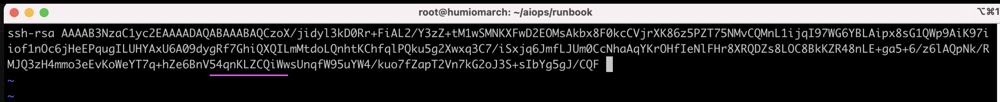

# Create and Execute RunBook in Watson AIOps

This article explains about how to create and execute Run Book in Watson AIOps.

The article is based on the the following

- RedHat OpenShift 4.6 on IBM Cloud (ROKS)
- Watson AI-Ops 3.1.0


## 1. Create RunBook

The creating runbook involves the following steps.

- Connect Backend System with SSH
- Create New Automation
- Create RunBook
- Create Trigger

### 1.1. Connect Backend System with SSH

In the event manager click on `Automation --> Runbook`


We are going to create a Runbook which has some automation scripts.

Click on `Automation --> New Automation`


Being, it is first time, we need to configure Integrations to connect from Event Manager to the target system, from where the script is going to get executed.

Click on `Configure`


You are in Integrations page.

Click on `Configure`


ssh into the target system.


Copy the file name high lighted.


In the target system, vi into the file.


Copy the Key from the UI.


Paste the key in the vi and save it.



Click on `Save`.


You can see the script is connected with the target system.


### 1.2. Create New Automation

Goto `Automation > Runbooks`


Click on `Automations > New Automation`


Enter values for the High lighted fields.


Give your script in the `Script` text box.

This script will get executed when the runbook is started.

Click on `Edit` button in the `target` row.


You can enter here the `IP Address` of the target system.

Click on  `Save`


Click on `Edit` button in the `user` row.


You can enter the `user id` here to login into target system.


Click on  `Save`


You can see the automation created here.


### 1.3. Create RunBook

Click on `Library` and `New Runbook`.


Enter `Name` and `Description`.

Click on `Add automated step`.


Select the listed `Automation`, which we created already.

Click on `Select this automation`.


It shows parameter mappings. you can choose `Use Default Value`

Click on `Save`.


Click on `Publish`.


Shows created Runbook.


### 1.4. Create Trigger

Click on `Triggers > Create New Trigger`.


Give `Name` and `Description`.

Give `Attribute`, `Operator` and `Value`.

Here `Attribute` and `Value` should match the event you get in event manager. Then only this runbook will get associated with that event.


#### Sample Event. 

Here Attribute is `Summary` and the value of that is `Rating Pod down`
```
  .....
            "Node":"ratings-v1-b6994bb9-js9rj",
            "AlertGroup":"Availability",
            "AlertKey":"ServiceDown",
            "Summary":"Rating Pod down",
            "Identifier":"ratings-v1-b6994bb9-js9rj",
            "OwnerGID":0,
            "Severity":5,
            "OwnerUID":0,
            "Type":1,
            "Manager":"CEM",
            "ScopeID":"BookInfoD",
            "Customer":"BookInfoDEnterprise"
  .....
```

Choose the runbook.

Click on `Select the Runbook`.


Uncheck  `Manual` in `Execution`.

Click on `Save`.


Runbook is created.


## 2. Execute RunBook

Whenever an event created in event manager, the event manager flags the event if the event attribute matches to the trigger condition of any of the runbook stored in event manager.

You can see the dot under `Runbook` column for the `Rating Pod Down` event.

Click on the event record


On the right side, you will have list of actions.

Click on `Launch Runbook`


It opens up the Runbook page.

Click on `Start Runbook`


It contains 1 step only.

Click on `Run`


Step executed and status is successful.

Click on `Complete`


Give feedback about the runbook.

Click on `Runbook Worked`


Click on `Execution`


You can see the execution history.

