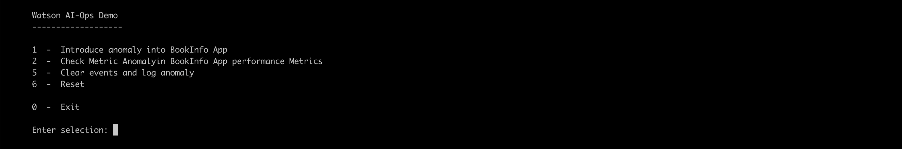

# Demo Script

## 1. Update config.sh

#### 1. OCP Server

Update `OCP_SERVER`

#### 2. OCP Token

1. Create OCP Token using the link [here](https://github.com/ibm-gsi-ecosystem/watson-ai-ops-guide/tree/master/601-getting-cluster-access-token2) 

2. Update the below property.

```
OCP_TOKEN=""
```

#### 3. IBM Cloud API Key

1. Create IBM Cloud API Key for accessing IKS Cluster using the link [here](https://github.com/ibm-gsi-ecosystem/watson-ai-ops-guide/tree/master/602-accessing-iks-cluster-using-api-key) 

2. Update the below property.

```
IBMCLOUD_API_KEY=
```

#### 4. IKS Cluster Id

Update the iks cluster id in the below property.

```
IKS_CLUSTER_ID=csadfdasd0ohsnstmnnqg
```

#### 5. Application Url

Update the bookinfo app url

```
APP_URL=http://1.1.1.1:31010/productpage?u=normal
```

#### 6. Namespace

Update the NAMESAPCE property, with namespace where the aiops is installed.

```
NAMESAPCE=aiops31
```

#### 7. Push Events to Event manager

Update the below property to push events to event manager using the link [here](../410-exposing-eventmgr-objectserver) 

```
EVENT_PASSWORD=
URL_EVENT_MGR=http://objectserver-route-xxxxxxxxx.appdomain.cloud/objectserver/restapi/alerts/status
```

#### 8. Metrics Manager VM

Update the below property with the metrics manager vm.

```
METRICS_VM=scadmin@1.1.1.1
```

## 2. Run the demo

Run `sh 01-demo.sh` to start the demo.

You will see the menu options like this.



Enter `1` to choose the menu option `1  -  Introduce anomaly into BookInfo App`


## 3. Run the demo for Metric Manager (Predictive Insights)

Run `sh 01-demo.sh` to start the demo.

You will see the menu options like this.


Enter `2` to choose the menu option `2  -  Check Metric Anomalyin BookInfo App performance Metrics`

